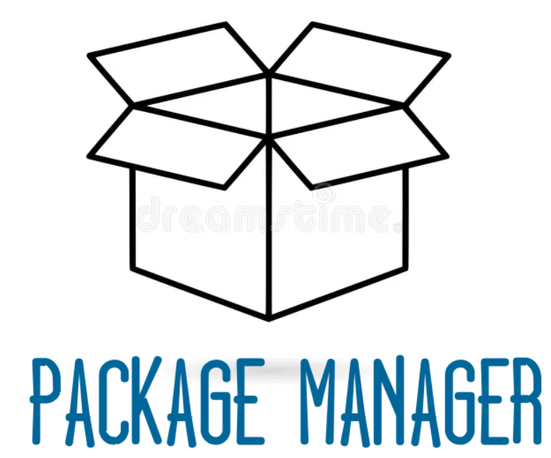

<!-- PROJECT LOGO -->
 

  

  

    Customized ansible-scripts for installing packages on Debian/Ubuntu systems. 
     
    <a href="https://github.com/mhasan49/package-manager/tree/v1.0/docs/docs"><strong>Explore the docs »</strong></a>
     
  

## Step1: Modify the **packages.txt** file.

- This script is designed to automate the installation process for various packages on Debian/Ubuntu systems using Bash scripting and Ansible.
- The `packages.txt` file contains a list of packages that the script will install. The user can modify this file to include or exclude packages from the installation process. 
## Step2: Run the script.

- This script requires root privileges to execute properly.It is intended for Debian/Ubuntu systems.In later versions, support for other distributions will be added.

- `sudo bash install.sh` or you may use the `ubuntu/Makefile`  for the same. Type `make help` for more information. 

<!--  -->

## Step3: Select the packages to install.

- The script will display a checklist dialog containing the packages from the **packages.txt** file. The user can select the packages they want to install by pressing the spacebar. After selecting the packages, press "OK" to proceed with the installation.

 

    
  </a>

## Step4: Installation process.

- Make sure to check the logs for any errors or warnings. It generates logs for each installation task. Logs are stored in the 'log' directory within the script's current directory. Each log file is named based on the task.

## Step5: Backup/Restore:

- It also provides an option to backup and restore the installed packages. The user can select the "Backup" option to create a backup of `all the packages present in your system`. Similarly, the "Restore" option can be used to restore the installed packages from a `backup.txt` file.

